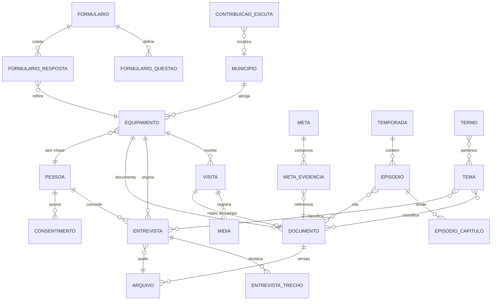

# Arquitetura de Banco de Dados
## Observatório de Cultura e Economia Criativa na Região do Vale do Rio Real

**Documento:** v1 — especificação de dados (complementa a *Arquitetura de Informação e Técnica v1*)
**SGBD alvo:** PostgreSQL 15+ (Supabase ou Neon)
**Escopo:** acervo da pesquisa, prestação de contas, podcast, trilha educativa e canais de escuta

---

## 0. Uma correção de rota deliberada

A arquitetura anterior recomendava **não usar banco de dados na v1**, e essa recomendação continua correta para o *escopo mínimo*: um site que só publica PDFs e páginas de leitura não precisa de banco.

O que muda a conta são justamente as **sugestões além do escopo mínimo** que você pediu para incorporar:

| Recurso sugerido | Por que exige persistência |
|---|---|
| Formulário de escuta permanente (#9) | Recebe dados de terceiros continuamente, com moderação |
| Painel de números do projeto (#3) | Indicadores versionados, atualizáveis sem redeploy |
| Página de metas com evidências (#1) | Relação N:N entre metas e anexos, com histórico |
| Dados abertos com dicionário (#4) | Respostas de formulário consultáveis e exportáveis |
| Busca interna (#14) | Índice full-text sobre todo o acervo |
| Continuidade pós-edital / 2ª temporada (#5, #13) | O acervo cresce depois que o site é entregue |

Daí o desenho abaixo, que é **híbrido e não negocia a preservação**:

> **O banco é a camada de gestão. Os arquivos e o HTML estático são a camada de preservação.**

Se o banco cair, sumir ou o projeto perder a assinatura do provedor, o site continua no ar e a prestação de contas continua íntegra — porque as páginas são geradas estaticamente no build e os arquivos vivem em armazenamento de objetos com URL própria e hash. O banco nunca é o único lugar onde uma evidência existe. Essa é a decisão arquitetural mais importante deste documento.

```
Postgres (gestão)  ──build/webhook──▶  Next.js SSG/ISR  ──▶  HTML estático (preservação)
       │                                                          ▲
       └──▶ Blob/R2: PDF, MP3, imagens (URL estável + SHA-256) ───┘
```

---

## 1. Convenções

| Convenção | Regra |
|---|---|
| Nomes | `snake_case`, tabelas no **singular**, em português (alinhado ao domínio e à equipe) |
| Chave primária | `id uuid PRIMARY KEY DEFAULT gen_random_uuid()` |
| Chave pública | `slug citext UNIQUE` — é ela que aparece na URL, nunca o id |
| Datas | `timestamptz` sempre; `date` quando o horário for irrelevante (data de visita) |
| Timestamps | `criado_em`, `atualizado_em` em toda tabela, via trigger |
| Exclusão | **Soft delete** (`arquivado_em`) — evidência de edital não se apaga |
| Publicação | `status status_publicacao` + `publicado_em`; o build só lê `publicado` |
| Textos longos | `text`, nunca `varchar(n)` arbitrário |
| Dados semiestruturados | `jsonb` apenas para respostas de formulário e metadados de origem |
| Migrações | versionadas em `/db/migrations`, aplicadas por CI; nada de alteração manual em produção |

---

## 2. Diagrama de entidades



---

## 3. Tipos enumerados

```sql
CREATE TYPE status_publicacao AS ENUM
  ('rascunho', 'em_revisao', 'publicado', 'arquivado');

CREATE TYPE tipo_equipamento AS ENUM
  ('ecoparque', 'museu', 'centro_cultural', 'comunidade', 'rota_turistica', 'orgao_publico');

CREATE TYPE situacao_equipamento AS ENUM
  ('ativo', 'intermitente', 'desativado', 'potencial');

CREATE TYPE tipo_documento AS ENUM
  ('relatorio_tecnico', 'diagnostico_interno', 'relato_campo', 'formulario_modelo',
   'relatorio_parcial', 'documento_final', 'modelagem_estatistica', 'entrevista_transcricao',
   'plano_aula', 'identidade_visual', 'painel_dados', 'outro');

CREATE TYPE tipo_midia AS ENUM
  ('pdf', 'audio', 'imagem', 'video', 'planilha', 'apresentacao', 'dataset', 'outro');

CREATE TYPE tipo_pessoa AS ENUM
  ('pesquisador', 'ator_chave', 'agente_publico', 'lideranca_comunitaria', 'colaborador');

CREATE TYPE status_meta AS ENUM
  ('alcancada', 'superada', 'em_desenvolvimento', 'nao_iniciada', 'substituida');

CREATE TYPE tipo_formulario AS ENUM
  ('rotina_funcionamento', 'publico_consumidor');

CREATE TYPE tipo_consentimento AS ENUM
  ('uso_imagem', 'uso_audio', 'dados_pessoais', 'publicacao_entrevista');

CREATE TYPE status_moderacao AS ENUM
  ('pendente', 'aprovado', 'rejeitado', 'spam');
```

---

## 4. Infraestrutura comum

```sql
CREATE EXTENSION IF NOT EXISTS pgcrypto;
CREATE EXTENSION IF NOT EXISTS citext;
CREATE EXTENSION IF NOT EXISTS unaccent;
CREATE EXTENSION IF NOT EXISTS postgis;   -- opcional, ver §6.2

-- unaccent() não é IMMUTABLE; sem este invólucro não é possível
-- indexar nem usar em coluna gerada.
CREATE OR REPLACE FUNCTION sem_acento(texto text)
RETURNS text LANGUAGE sql IMMUTABLE PARALLEL SAFE STRICT AS
$$ SELECT public.unaccent('public.unaccent', texto) $$;

CREATE OR REPLACE FUNCTION set_atualizado_em()
RETURNS trigger LANGUAGE plpgsql AS $$
BEGIN
  NEW.atualizado_em = now();
  RETURN NEW;
END $$;
```

Aplicar o trigger em toda tabela com `atualizado_em`:

```sql
CREATE TRIGGER trg_atualizado_em BEFORE UPDATE ON <tabela>
FOR EACH ROW EXECUTE FUNCTION set_atualizado_em();
```

---

## 5. Camada de arquivos — o núcleo da prestação de contas

Separar **`documento`** (a obra intelectual) de **`arquivo`** (o binário) é o que permite versionar um relatório, publicar o mesmo conteúdo em PDF e HTML, e trocar um anexo sem perder o histórico da URL.

```sql
CREATE TABLE arquivo (
  id             uuid PRIMARY KEY DEFAULT gen_random_uuid(),
  chave_storage  text NOT NULL UNIQUE,      -- ex: arquivos/relatorios/recanto-da-serra-v2.pdf
  url_publica    text NOT NULL UNIQUE,      -- URL estável do domínio próprio
  nome_original  text,
  tipo_midia     tipo_midia NOT NULL,
  mime_type      text NOT NULL,
  bytes          bigint NOT NULL CHECK (bytes > 0),
  sha256         char(64) NOT NULL,         -- integridade para auditoria
  duracao_seg    integer,                   -- áudio/vídeo
  largura_px     integer,
  altura_px      integer,
  origem_url     text,                      -- Drive/Figma de onde veio (redundância)
  origem_sistema text,                      -- 'google_drive' | 'figma' | 'upload'
  espelhado_em   timestamptz,               -- quando saiu do Drive para storage próprio
  criado_em      timestamptz NOT NULL DEFAULT now(),
  atualizado_em  timestamptz NOT NULL DEFAULT now()
);

CREATE INDEX idx_arquivo_sha256 ON arquivo (sha256);
CREATE INDEX idx_arquivo_tipo   ON arquivo (tipo_midia);
```

```sql
CREATE TABLE documento (
  id                uuid PRIMARY KEY DEFAULT gen_random_uuid(),
  slug              citext NOT NULL UNIQUE,
  titulo            text NOT NULL,
  tipo              tipo_documento NOT NULL,
  resumo            text,
  autoria           text[],                       -- nomes livres; pesquisadores em pessoa
  data_referencia   date,                         -- data do conteúdo, não da publicação
  equipamento_id    uuid REFERENCES equipamento(id) ON DELETE SET NULL,
  municipio_id      uuid REFERENCES municipio(id) ON DELETE SET NULL,
  licenca           text NOT NULL DEFAULT 'CC BY-SA 4.0',
  exigido_pelo_edital boolean NOT NULL DEFAULT false,
  ordem_anexo       integer,                      -- ordem na Sala do Avaliador
  status            status_publicacao NOT NULL DEFAULT 'rascunho',
  publicado_em      timestamptz,
  arquivado_em      timestamptz,
  criado_em         timestamptz NOT NULL DEFAULT now(),
  atualizado_em     timestamptz NOT NULL DEFAULT now(),
  busca             tsvector GENERATED ALWAYS AS (
                      to_tsvector('portuguese',
                        sem_acento(coalesce(titulo,'') || ' ' || coalesce(resumo,'')))
                    ) STORED,
  CONSTRAINT publicado_exige_data
    CHECK (status <> 'publicado' OR publicado_em IS NOT NULL)
);

CREATE INDEX idx_documento_busca  ON documento USING gin (busca);
CREATE INDEX idx_documento_tipo   ON documento (tipo) WHERE status = 'publicado';
CREATE INDEX idx_documento_anexo  ON documento (ordem_anexo)
  WHERE exigido_pelo_edital AND status = 'publicado';
```

```sql
CREATE TABLE documento_arquivo (
  documento_id  uuid NOT NULL REFERENCES documento(id) ON DELETE CASCADE,
  arquivo_id    uuid NOT NULL REFERENCES arquivo(id) ON DELETE RESTRICT,
  versao        integer NOT NULL DEFAULT 1,
  rotulo        text,                     -- 'PDF acessível', 'versão em linguagem simples'
  principal     boolean NOT NULL DEFAULT false,
  PRIMARY KEY (documento_id, arquivo_id)
);

-- garante no máximo um arquivo principal por documento
CREATE UNIQUE INDEX idx_doc_arquivo_principal
  ON documento_arquivo (documento_id) WHERE principal;
```

> **Regra de negócio inegociável:** nenhum registro com `exigido_pelo_edital = true` pode ser publicado sem ao menos um `documento_arquivo` cujo `arquivo.espelhado_em IS NOT NULL`. Isso impede que um anexo obrigatório dependa exclusivamente de um link do Drive. Implementar como teste no CI e como *check* na view de publicação (§9).

---

## 6. Domínio da pesquisa

### 6.1 Município

```sql
CREATE TABLE municipio (
  id            uuid PRIMARY KEY DEFAULT gen_random_uuid(),
  slug          citext NOT NULL UNIQUE,
  nome          text NOT NULL,
  uf            char(2) NOT NULL DEFAULT 'SE',
  codigo_ibge   char(7) UNIQUE,
  regiao        text,                     -- 'Centro-Sul Sergipano', 'Grande Aracaju'
  populacao     integer,
  sintese       text,
  criado_em     timestamptz NOT NULL DEFAULT now(),
  atualizado_em timestamptz NOT NULL DEFAULT now()
);
```
*Seed:* Tobias Barreto, Itabaianinha, São Cristóvão, Tomar do Geru, Riachão do Dantas, Simão Dias.

### 6.2 Equipamento

```sql
CREATE TABLE equipamento (
  id             uuid PRIMARY KEY DEFAULT gen_random_uuid(),
  slug           citext NOT NULL UNIQUE,
  nome           text NOT NULL,
  nome_curto     text,
  tipo           tipo_equipamento NOT NULL,
  situacao       situacao_equipamento NOT NULL DEFAULT 'ativo',
  municipio_id   uuid NOT NULL REFERENCES municipio(id) ON DELETE RESTRICT,
  povoado        text,                    -- Jacaré, Borda da Mata, Samambaia
  latitude       numeric(9,6),
  longitude      numeric(9,6),
  ator_chave_id  uuid REFERENCES pessoa(id) ON DELETE SET NULL,
  sintese        text,
  historico      text,
  destaque_home  boolean NOT NULL DEFAULT false,
  status         status_publicacao NOT NULL DEFAULT 'rascunho',
  publicado_em   timestamptz,
  criado_em      timestamptz NOT NULL DEFAULT now(),
  atualizado_em  timestamptz NOT NULL DEFAULT now(),
  CONSTRAINT coordenadas_completas
    CHECK ((latitude IS NULL) = (longitude IS NULL))
);
```

*Seed:* Recanto da Serra (`ecoparque`, ativo), Borda da Mata (`museu`, intermitente), Serra dos Macacos (`comunidade`, potencial), Ilha Grande (`comunidade`, ativo), Pedra Branca (`rota_turistica`, **desativado** — o caso #10 da arquitetura de informação).

`numeric(9,6)` basta para o mapa Leaflet. PostGIS só se houver consulta espacial real (raio, rota, área de preservação) — não instale por antecipação.

### 6.3 Pessoa e consentimento

```sql
CREATE TABLE pessoa (
  id            uuid PRIMARY KEY DEFAULT gen_random_uuid(),
  slug          citext UNIQUE,
  nome          text NOT NULL,
  tipo          tipo_pessoa NOT NULL,
  cargo         text,
  instituicao   text,
  bio_curta     text,
  foto_id       uuid REFERENCES arquivo(id) ON DELETE SET NULL,
  exibir_no_site boolean NOT NULL DEFAULT false,
  contato_email citext,                   -- interno, nunca renderizado
  criado_em     timestamptz NOT NULL DEFAULT now(),
  atualizado_em timestamptz NOT NULL DEFAULT now()
);

CREATE TABLE consentimento (
  id             uuid PRIMARY KEY DEFAULT gen_random_uuid(),
  pessoa_id      uuid NOT NULL REFERENCES pessoa(id) ON DELETE CASCADE,
  tipo           tipo_consentimento NOT NULL,
  concedido_em   date NOT NULL,
  escopo         text NOT NULL,           -- 'publicação integral', 'apenas trechos'
  termo_id       uuid REFERENCES arquivo(id) ON DELETE SET NULL,  -- termo assinado
  revogado_em    date,
  observacao     text,
  criado_em      timestamptz NOT NULL DEFAULT now(),
  UNIQUE (pessoa_id, tipo)
);
```

> Sem `consentimento` válido e não revogado, o áudio da entrevista **não é publicado**. Esse é o risco jurídico #11 da arquitetura anterior, resolvido no schema em vez de no processo.

### 6.4 Visita e mídia de campo

```sql
CREATE TABLE visita (
  id              uuid PRIMARY KEY DEFAULT gen_random_uuid(),
  slug            citext NOT NULL UNIQUE,
  numeral         text,                   -- 'I', 'II', ... conforme o relatório
  equipamento_id  uuid REFERENCES equipamento(id) ON DELETE SET NULL,
  data            date NOT NULL,
  hora_inicio     time,
  hora_fim        time,
  descricao       text,
  relato_id       uuid REFERENCES documento(id) ON DELETE SET NULL,
  status          status_publicacao NOT NULL DEFAULT 'rascunho',
  criado_em       timestamptz NOT NULL DEFAULT now(),
  atualizado_em   timestamptz NOT NULL DEFAULT now()
);

CREATE TABLE visita_participante (
  visita_id  uuid NOT NULL REFERENCES visita(id) ON DELETE CASCADE,
  pessoa_id  uuid NOT NULL REFERENCES pessoa(id) ON DELETE CASCADE,
  papel      text,
  PRIMARY KEY (visita_id, pessoa_id)
);

CREATE TABLE midia (
  id            uuid PRIMARY KEY DEFAULT gen_random_uuid(),
  arquivo_id    uuid NOT NULL REFERENCES arquivo(id) ON DELETE RESTRICT,
  visita_id     uuid REFERENCES visita(id) ON DELETE SET NULL,
  equipamento_id uuid REFERENCES equipamento(id) ON DELETE SET NULL,
  legenda       text,
  texto_alt     text NOT NULL,            -- obrigatório: WCAG 2.1 AA
  credito       text,
  capturada_em  date,
  ordem         integer NOT NULL DEFAULT 0,
  status        status_publicacao NOT NULL DEFAULT 'rascunho',
  criado_em     timestamptz NOT NULL DEFAULT now(),
  atualizado_em timestamptz NOT NULL DEFAULT now()
);
```

`texto_alt NOT NULL` faz a acessibilidade ser garantida pelo banco, não pela lembrança de quem sobe a foto. É a única coluna de texto obrigatória em toda a modelagem, e é de propósito.

*Seed das 7 visitas:* 20/06 (I, Recanto), 14/07 (II, Borda da Mata), 02/08 (III, Serra dos Macacos), 03/10 (IV), 08/11 (V), 18/12 (VI), 18/12 (VII, Borda da Mata), mais a II Visita à Serra dos Macacos em 05/04/2026.

### 6.5 Entrevista

```sql
CREATE TABLE entrevista (
  id                uuid PRIMARY KEY DEFAULT gen_random_uuid(),
  slug              citext NOT NULL UNIQUE,
  titulo            text NOT NULL,
  entrevistado_id   uuid NOT NULL REFERENCES pessoa(id) ON DELETE RESTRICT,
  equipamento_id    uuid REFERENCES equipamento(id) ON DELETE SET NULL,
  municipio_id      uuid REFERENCES municipio(id) ON DELETE SET NULL,
  data              date NOT NULL,
  local             text,
  duracao_seg       integer,
  audio_id          uuid REFERENCES arquivo(id) ON DELETE SET NULL,
  transcricao       text,
  transcricao_doc_id uuid REFERENCES documento(id) ON DELETE SET NULL,
  audio_publico     boolean NOT NULL DEFAULT false,
  status            status_publicacao NOT NULL DEFAULT 'rascunho',
  publicado_em      timestamptz,
  criado_em         timestamptz NOT NULL DEFAULT now(),
  atualizado_em     timestamptz NOT NULL DEFAULT now(),
  busca             tsvector GENERATED ALWAYS AS (
                      to_tsvector('portuguese',
                        sem_acento(coalesce(titulo,'') || ' ' || coalesce(transcricao,'')))
                    ) STORED
);

CREATE INDEX idx_entrevista_busca ON entrevista USING gin (busca);

CREATE TABLE entrevista_trecho (
  id             uuid PRIMARY KEY DEFAULT gen_random_uuid(),
  entrevista_id  uuid NOT NULL REFERENCES entrevista(id) ON DELETE CASCADE,
  inicio_seg     integer NOT NULL CHECK (inicio_seg >= 0),
  fim_seg        integer CHECK (fim_seg > inicio_seg),
  citacao        text NOT NULL,
  destaque       boolean NOT NULL DEFAULT false,
  ordem          integer NOT NULL DEFAULT 0
);
```

`entrevista_trecho` é o que permite reaproveitar a mesma citação no documento final, no episódio do podcast e na página do equipamento sem duplicar texto — e cita sempre com o timestamp de origem.

*Seed:* Josenilson Bispo (27/03/2026, Memorial de Tobias Barreto), Oviêdo e Neide Abreu (28/03/2026), Pedro Menezes (05/04/2026), Paola Santana (06/04/2026), liderança de Ilha Grande (11/04/2026).

---

## 7. Metas e prestação de contas

```sql
CREATE TABLE meta (
  id              uuid PRIMARY KEY DEFAULT gen_random_uuid(),
  codigo          text NOT NULL UNIQUE,   -- 'M01', 'M02'...
  texto_original  text NOT NULL,          -- literal do projeto aprovado
  quantidade_prevista numeric,
  quantidade_realizada numeric,
  unidade         text,                   -- 'formulários', 'entrevistas', 'empregos'
  status          status_meta NOT NULL,
  nota_execucao   text,                   -- por que mudou, quando, com que justificativa
  etapa           text,                   -- '2. Levantamento dos dados'
  ordem           integer NOT NULL DEFAULT 0,
  atualizado_em   timestamptz NOT NULL DEFAULT now(),
  CONSTRAINT substituida_exige_nota
    CHECK (status <> 'substituida' OR nota_execucao IS NOT NULL)
);

CREATE TABLE meta_evidencia (
  meta_id      uuid NOT NULL REFERENCES meta(id) ON DELETE CASCADE,
  documento_id uuid REFERENCES documento(id) ON DELETE CASCADE,
  entrevista_id uuid REFERENCES entrevista(id) ON DELETE CASCADE,
  visita_id    uuid REFERENCES visita(id) ON DELETE CASCADE,
  observacao   text,
  CONSTRAINT uma_evidencia_por_linha CHECK (
    num_nonnulls(documento_id, entrevista_id, visita_id) = 1
  )
);
```

O `CHECK` com `num_nonnulls` implementa uma associação polimórfica sem perder integridade referencial — cada linha aponta para exatamente um tipo de evidência, e cada FK continua validada pelo banco.

O `substituida_exige_nota` codifica a lição central do relatório parcial: os relatórios mensais foram substituídos pelo Painel Vivo + Diagnóstico Interno, e essa troca **precisa** vir acompanhada de justificativa. O banco não deixa publicar sem ela.

```sql
CREATE TABLE cronograma_atividade (
  id            uuid PRIMARY KEY DEFAULT gen_random_uuid(),
  etapa         text NOT NULL,
  atividade     text NOT NULL,
  descricao     text,
  inicio        date NOT NULL,
  fim           date NOT NULL,
  concluida     boolean NOT NULL DEFAULT false,
  meta_id       uuid REFERENCES meta(id) ON DELETE SET NULL,
  CONSTRAINT periodo_valido CHECK (fim >= inicio)
);

CREATE TABLE indicador (
  id            uuid PRIMARY KEY DEFAULT gen_random_uuid(),
  chave         citext NOT NULL UNIQUE,   -- 'formularios_rotina_total'
  rotulo        text NOT NULL,            -- 'Formulários de rotina coletados'
  valor         numeric NOT NULL,
  unidade       text,
  contexto      text,
  destaque_home boolean NOT NULL DEFAULT false,
  ordem         integer NOT NULL DEFAULT 0,
  apurado_em    date NOT NULL,
  atualizado_em timestamptz NOT NULL DEFAULT now()
);
```
*Seed de `indicador`:* 40 formulários de rotina, 63 registros de público consumidor, 5 meses de coleta, 7 visitas, 7 trabalhos remunerados, 3 municípios.

---

## 8. Formulários e dados abertos

Os dados nasceram no Google Forms. O banco os recebe **já anonimizados**, uma vez, na importação — e passa a ser a fonte para o portal de dados abertos.

```sql
CREATE TABLE formulario (
  id             uuid PRIMARY KEY DEFAULT gen_random_uuid(),
  slug           citext NOT NULL UNIQUE,
  tipo           tipo_formulario NOT NULL,
  titulo         text NOT NULL,
  descricao      text,
  modelo_doc_id  uuid REFERENCES documento(id) ON DELETE SET NULL,  -- PDF do modelo
  periodo_inicio date,
  periodo_fim    date,
  criado_em      timestamptz NOT NULL DEFAULT now()
);

CREATE TABLE formulario_questao (
  id            uuid PRIMARY KEY DEFAULT gen_random_uuid(),
  formulario_id uuid NOT NULL REFERENCES formulario(id) ON DELETE CASCADE,
  chave         citext NOT NULL,          -- nome da coluna no CSV exportado
  enunciado     text NOT NULL,
  tipo_resposta text NOT NULL,            -- 'texto' | 'numero' | 'escolha' | 'data'
  opcoes        text[],
  publica       boolean NOT NULL DEFAULT true,   -- false = não exportar (risco de reidentificação)
  ordem         integer NOT NULL DEFAULT 0,
  UNIQUE (formulario_id, chave)
);

CREATE TABLE formulario_resposta (
  id              uuid PRIMARY KEY DEFAULT gen_random_uuid(),
  formulario_id   uuid NOT NULL REFERENCES formulario(id) ON DELETE CASCADE,
  equipamento_id  uuid REFERENCES equipamento(id) ON DELETE SET NULL,
  respondido_em   date NOT NULL,
  respostas       jsonb NOT NULL,
  anonimizada     boolean NOT NULL DEFAULT true,
  origem          text NOT NULL DEFAULT 'google_forms',
  importada_em    timestamptz NOT NULL DEFAULT now(),
  CONSTRAINT sem_dado_pessoal CHECK (anonimizada)
);

CREATE INDEX idx_resposta_jsonb ON formulario_resposta USING gin (respostas jsonb_path_ops);
CREATE INDEX idx_resposta_equip ON formulario_resposta (formulario_id, equipamento_id, respondido_em);
```

`formulario_questao` **é o dicionário de dados** exigido pela sugestão #4 — a mesma tabela gera o cabeçalho do CSV e a documentação publicada. O `CHECK (anonimizada)` torna impossível gravar uma resposta não anonimizada: se um dia for preciso, a mudança exige migração explícita e revisada.

**Exportação de dados abertos:**

```sql
CREATE VIEW vw_dados_abertos_publico_consumidor AS
SELECT r.respondido_em,
       e.slug  AS equipamento,
       m.nome  AS municipio,
       r.respostas - (SELECT coalesce(array_agg(q.chave::text), '{}')
                      FROM formulario_questao q
                      WHERE q.formulario_id = r.formulario_id AND NOT q.publica) AS respostas
FROM formulario_resposta r
JOIN formulario f  ON f.id = r.formulario_id
LEFT JOIN equipamento e ON e.id = r.equipamento_id
LEFT JOIN municipio m   ON m.id = e.municipio_id
WHERE f.tipo = 'publico_consumidor';
```

O operador `jsonb - text[]` remove as chaves não públicas na saída, sem tocar no dado armazenado.

---

## 9. Podcast PodObservar

```sql
CREATE TABLE temporada (
  id          uuid PRIMARY KEY DEFAULT gen_random_uuid(),
  numero      integer NOT NULL UNIQUE,
  titulo      text NOT NULL,
  descricao   text,
  ano         integer,
  capa_id     uuid REFERENCES arquivo(id) ON DELETE SET NULL
);

CREATE TABLE episodio (
  id             uuid PRIMARY KEY DEFAULT gen_random_uuid(),
  slug           citext NOT NULL UNIQUE,
  temporada_id   uuid NOT NULL REFERENCES temporada(id) ON DELETE RESTRICT,
  numero         integer NOT NULL,
  titulo         text NOT NULL,
  resumo         text NOT NULL,           -- vira <description> no RSS
  audio_id       uuid NOT NULL REFERENCES arquivo(id) ON DELETE RESTRICT,
  duracao_seg    integer NOT NULL,
  transcricao    text NOT NULL,           -- acessibilidade: obrigatória
  capa_id        uuid REFERENCES arquivo(id) ON DELETE SET NULL,
  explicito      boolean NOT NULL DEFAULT false,
  url_spotify    text,
  url_youtube    text,
  status         status_publicacao NOT NULL DEFAULT 'rascunho',
  publicado_em   timestamptz,
  criado_em      timestamptz NOT NULL DEFAULT now(),
  atualizado_em  timestamptz NOT NULL DEFAULT now(),
  busca          tsvector GENERATED ALWAYS AS (
                   to_tsvector('portuguese',
                     sem_acento(coalesce(titulo,'') || ' ' || coalesce(resumo,'') || ' ' || coalesce(transcricao,'')))
                 ) STORED,
  UNIQUE (temporada_id, numero)
);

CREATE TABLE episodio_capitulo (
  id           uuid PRIMARY KEY DEFAULT gen_random_uuid(),
  episodio_id  uuid NOT NULL REFERENCES episodio(id) ON DELETE CASCADE,
  inicio_seg   integer NOT NULL CHECK (inicio_seg >= 0),
  titulo       text NOT NULL,
  ordem        integer NOT NULL DEFAULT 0
);

CREATE TABLE episodio_referencia (
  episodio_id   uuid NOT NULL REFERENCES episodio(id) ON DELETE CASCADE,
  documento_id  uuid REFERENCES documento(id) ON DELETE CASCADE,
  entrevista_id uuid REFERENCES entrevista(id) ON DELETE CASCADE,
  trecho_id     uuid REFERENCES entrevista_trecho(id) ON DELETE SET NULL,
  CONSTRAINT uma_referencia_por_linha CHECK (
    num_nonnulls(documento_id, entrevista_id) = 1
  )
);
```

`transcricao text NOT NULL` no episódio é a contrapartida do argumento de acessibilidade atitudinal do relatório: o podcast é a audiodescrição da pesquisa para quem não lê o documento; a transcrição é o inverso, para quem não ouve o áudio. O feed RSS 2.0 com namespace iTunes é gerado no build a partir dessas tabelas — o site é o dono do feed, não a plataforma.

---

## 10. Trilha educativa e taxonomia

```sql
CREATE TABLE tema (
  id        uuid PRIMARY KEY DEFAULT gen_random_uuid(),
  slug      citext NOT NULL UNIQUE,
  nome      text NOT NULL,
  descricao text,
  cor       text
);
-- seed: economia solidária, economia criativa, ecoturismo, patrimônio imaterial,
--       agricultura familiar, política cultural, preservação ambiental

CREATE TABLE documento_tema (
  documento_id uuid NOT NULL REFERENCES documento(id) ON DELETE CASCADE,
  tema_id      uuid NOT NULL REFERENCES tema(id) ON DELETE CASCADE,
  PRIMARY KEY (documento_id, tema_id)
);

CREATE TABLE entrevista_tema (
  entrevista_id uuid NOT NULL REFERENCES entrevista(id) ON DELETE CASCADE,
  tema_id       uuid NOT NULL REFERENCES tema(id) ON DELETE CASCADE,
  PRIMARY KEY (entrevista_id, tema_id)
);

CREATE TABLE termo (
  id             uuid PRIMARY KEY DEFAULT gen_random_uuid(),
  slug           citext NOT NULL UNIQUE,
  termo          text NOT NULL,
  definicao      text NOT NULL,           -- linguagem simples, público Ensino Médio
  exemplo_local  text,                    -- ancorado no território
  tema_id        uuid REFERENCES tema(id) ON DELETE SET NULL,
  ver_tambem     uuid[] DEFAULT '{}',
  status         status_publicacao NOT NULL DEFAULT 'rascunho',
  criado_em      timestamptz NOT NULL DEFAULT now(),
  atualizado_em  timestamptz NOT NULL DEFAULT now()
);

CREATE TABLE material_didatico (
  id             uuid PRIMARY KEY DEFAULT gen_random_uuid(),
  slug           citext NOT NULL UNIQUE,
  titulo         text NOT NULL,
  publico        text NOT NULL,           -- 'Ensino Médio', 'Ensino Superior'
  duracao_min    integer,
  objetivos      text[],
  descricao      text,
  episodio_id    uuid REFERENCES episodio(id) ON DELETE SET NULL,
  arquivo_id     uuid REFERENCES arquivo(id) ON DELETE SET NULL,
  status         status_publicacao NOT NULL DEFAULT 'rascunho',
  criado_em      timestamptz NOT NULL DEFAULT now(),
  atualizado_em  timestamptz NOT NULL DEFAULT now()
);

CREATE TABLE acao_extensao (             -- "O Observatório na Comunidade"
  id            uuid PRIMARY KEY DEFAULT gen_random_uuid(),
  slug          citext NOT NULL UNIQUE,
  titulo        text NOT NULL,
  tipo          text NOT NULL,            -- 'escola' | 'radio' | 'universidade' | 'prefeitura'
  instituicao   text NOT NULL,
  municipio_id  uuid REFERENCES municipio(id) ON DELETE SET NULL,
  data          date NOT NULL,
  publico_estimado integer,
  relato        text,
  status        status_publicacao NOT NULL DEFAULT 'rascunho',
  criado_em     timestamptz NOT NULL DEFAULT now(),
  atualizado_em timestamptz NOT NULL DEFAULT now()
);
```

`acao_extensao` é o registro da contrapartida social — escolas de Samambaia, Abelardo Barreto do Rosário e Prof. Maria Lucilene, IFS, Rádio Tobias FM, Rádio Clube. Vira ao mesmo tempo página pública e linha de prestação de contas.

---

## 11. Canais de escuta e interação

```sql
CREATE TABLE contribuicao_escuta (
  id             uuid PRIMARY KEY DEFAULT gen_random_uuid(),
  nome           text,
  email          citext,
  municipio_id   uuid REFERENCES municipio(id) ON DELETE SET NULL,
  vinculo        text,
  mensagem       text NOT NULL,
  equipamento_id uuid REFERENCES equipamento(id) ON DELETE SET NULL,
  autoriza_contato boolean NOT NULL DEFAULT false,
  autoriza_publicacao boolean NOT NULL DEFAULT false,
  status         status_moderacao NOT NULL DEFAULT 'pendente',
  moderado_por   text,
  moderado_em    timestamptz,
  expurgo_em     date NOT NULL DEFAULT (current_date + interval '18 months'),
  criado_em      timestamptz NOT NULL DEFAULT now()
);

CREATE INDEX idx_escuta_moderacao ON contribuicao_escuta (status, criado_em DESC);
CREATE INDEX idx_escuta_expurgo   ON contribuicao_escuta (expurgo_em);
```

Sem IP, sem user-agent, sem cookie: o mínimo necessário, com prazo de expurgo gravado na própria linha. Uma rotina diária (`pg_cron`) apaga o que venceu. Anti-spam por *honeypot* + Turnstile na borda, não no banco.

```sql
CREATE TABLE download_diario (            -- métrica agregada, sem identificar ninguém
  data          date NOT NULL,
  arquivo_id    uuid NOT NULL REFERENCES arquivo(id) ON DELETE CASCADE,
  total         integer NOT NULL DEFAULT 0,
  PRIMARY KEY (data, arquivo_id)
);
```

---

## 12. Auditoria e integridade

```sql
CREATE TABLE log_auditoria (
  id           bigserial PRIMARY KEY,
  tabela       text NOT NULL,
  registro_id  uuid NOT NULL,
  operacao     text NOT NULL CHECK (operacao IN ('INSERT','UPDATE','DELETE')),
  ator         text NOT NULL DEFAULT current_user,
  alteracoes   jsonb,
  ocorrido_em  timestamptz NOT NULL DEFAULT now()
);

CREATE INDEX idx_auditoria_registro ON log_auditoria (tabela, registro_id, ocorrido_em DESC);
```

Trigger genérico aplicado a `documento`, `arquivo`, `meta`, `entrevista` e `consentimento` — as cinco tabelas que sustentam a prestação de contas. Em auditoria, poder responder *"quando esse anexo mudou e quem mudou"* vale mais do que qualquer relatório.

```sql
CREATE TABLE redirecionamento (
  origem  text PRIMARY KEY,               -- '/relatorios/antigo'
  destino text NOT NULL,
  codigo  smallint NOT NULL DEFAULT 301,
  criado_em timestamptz NOT NULL DEFAULT now()
);
```

---

## 13. Views de consumo

```sql
-- Alimenta /prestacao-de-contas e /anexos.json
CREATE VIEW vw_anexo_publico AS
SELECT d.ordem_anexo,
       d.slug,
       d.titulo,
       d.tipo,
       d.resumo,
       d.data_referencia,
       d.licenca,
       a.url_publica    AS link_permanente,
       a.origem_url     AS link_origem,
       a.mime_type,
       a.bytes,
       a.sha256,
       d.publicado_em,
       (a.espelhado_em IS NOT NULL) AS espelhado
FROM documento d
JOIN documento_arquivo da ON da.documento_id = d.id AND da.principal
JOIN arquivo a            ON a.id = da.arquivo_id
WHERE d.status = 'publicado' AND d.arquivado_em IS NULL
ORDER BY d.ordem_anexo NULLS LAST, d.titulo;

-- Trava de publicação: anexo obrigatório sem espelho local
CREATE VIEW vw_pendencia_publicacao AS
SELECT d.slug, d.titulo, 'anexo obrigatório sem arquivo espelhado' AS pendencia
FROM documento d
LEFT JOIN documento_arquivo da ON da.documento_id = d.id AND da.principal
LEFT JOIN arquivo a            ON a.id = da.arquivo_id AND a.espelhado_em IS NOT NULL
WHERE d.exigido_pelo_edital AND d.status = 'publicado' AND a.id IS NULL
UNION ALL
SELECT e.slug, e.titulo, 'áudio público sem consentimento válido'
FROM entrevista e
LEFT JOIN consentimento c
  ON c.pessoa_id = e.entrevistado_id
 AND c.tipo = 'publicacao_entrevista'
 AND c.revogado_em IS NULL
WHERE e.audio_publico AND e.status = 'publicado' AND c.id IS NULL;
```

`vw_pendencia_publicacao` **deve quebrar o build do CI se retornar qualquer linha.** É a tradução em código dos dois riscos de maior impacto do documento anterior.

```sql
-- Busca interna unificada
CREATE MATERIALIZED VIEW mv_busca AS
SELECT 'documento' AS entidade, id, slug, titulo, busca FROM documento   WHERE status='publicado'
UNION ALL
SELECT 'entrevista', id, slug, titulo, busca FROM entrevista WHERE status='publicado'
UNION ALL
SELECT 'episodio',   id, slug, titulo, busca FROM episodio   WHERE status='publicado';

CREATE INDEX idx_mv_busca ON mv_busca USING gin (busca);
CREATE UNIQUE INDEX idx_mv_busca_pk ON mv_busca (entidade, id);
-- REFRESH MATERIALIZED VIEW CONCURRENTLY mv_busca;  -- no deploy
```

---

## 14. Segurança (Row Level Security)

Com Supabase, o site anônimo lê apenas o que está publicado; escrita só pela `service_role` via painel de administração.

```sql
ALTER TABLE documento ENABLE ROW LEVEL SECURITY;

CREATE POLICY leitura_publica ON documento
  FOR SELECT TO anon
  USING (status = 'publicado' AND arquivado_em IS NULL);

-- Tabelas com dado pessoal: nenhuma política para anon = invisíveis
ALTER TABLE consentimento         ENABLE ROW LEVEL SECURITY;
ALTER TABLE contribuicao_escuta   ENABLE ROW LEVEL SECURITY;
ALTER TABLE pessoa                ENABLE ROW LEVEL SECURITY;

CREATE POLICY insercao_escuta ON contribuicao_escuta
  FOR INSERT TO anon WITH CHECK (true);   -- pode enviar, não pode ler
```

Repetir `leitura_publica` para `equipamento`, `entrevista`, `episodio`, `midia`, `visita`, `termo`, `material_didatico`, `acao_extensao`. Tabelas sem dado pessoal e sem status (`tema`, `municipio`, `indicador`, `meta`) recebem política de leitura irrestrita.

---

## 15. Operação

| Tema | Definição |
|---|---|
| **Migrações** | Drizzle Kit ou Atlas, arquivos SQL versionados em `/db/migrations`, aplicadas no CI antes do build |
| **Seed** | Script idempotente com municípios, equipamentos, temas, pessoas, metas e cronograma extraídos do Relatório Parcial |
| **Importação** | Rotina única lendo os CSVs exportados do Google Forms → `formulario_resposta`, com anonimização e log de linhas descartadas |
| **Backup** | `pg_dump` diário para R2/S3 com retenção de 30 dias + dump mensal versionado |
| **Preservação** | Trimestralmente: exportar dados abertos em CSV + `vw_anexo_publico` em JSON e depositar no Zenodo (DOI). **O Zenodo, não o Postgres, é a garantia de longo prazo** |
| **Ambientes** | `dev` (local, Docker), `preview` (branch, dados de seed), `prod` |
| **Revalidação** | Webhook do CMS/admin → `revalidateTag()` no Next.js; nada de site dependendo do banco em tempo de requisição |
| **Custo esperado** | Faixa gratuita de Supabase/Neon cobre com folga o volume previsto (< 5 mil linhas, < 1 GB de metadados) |

---

## 16. Ordem de implementação

1. Extensões, enums, funções e triggers (§3–4)
2. `arquivo`, `documento`, `documento_arquivo` → **já habilita a Sala do Avaliador**, que é a Fase 1 do roadmap
3. `municipio`, `pessoa`, `equipamento`, `consentimento`
4. `visita`, `midia`, `entrevista`, `entrevista_trecho`
5. `meta`, `meta_evidencia`, `cronograma_atividade`, `indicador`
6. `formulario` e derivadas + importação dos CSVs
7. `temporada`, `episodio` e derivadas
8. `tema`, `termo`, `material_didatico`, `acao_extensao`
9. `contribuicao_escuta`, `download_diario`, `log_auditoria`, `redirecionamento`
10. Views, RLS e a trava `vw_pendencia_publicacao` no CI

---

## 17. O que este banco deliberadamente **não** faz

- **Não guarda o conteúdo editorial das páginas institucionais.** Home, metodologia e capítulos do documento final permanecem em MDX versionado no Git: são texto autoral, revisado por *pull request*, e sobrevivem à morte do banco.
- **Não hospeda binários.** Só metadados, hash e URL. Arquivo grande em coluna `bytea` é o caminho mais curto para um backup impossível de restaurar.
- **Não implementa autenticação de leitores.** O site é integralmente público; não há login, não há perfil, não há carrinho. Cada tabela de usuário que você não cria é uma obrigação de LGPD que você não assume.
- **Não faz analytics comportamental.** Apenas contagem agregada de downloads, sem identificação.
